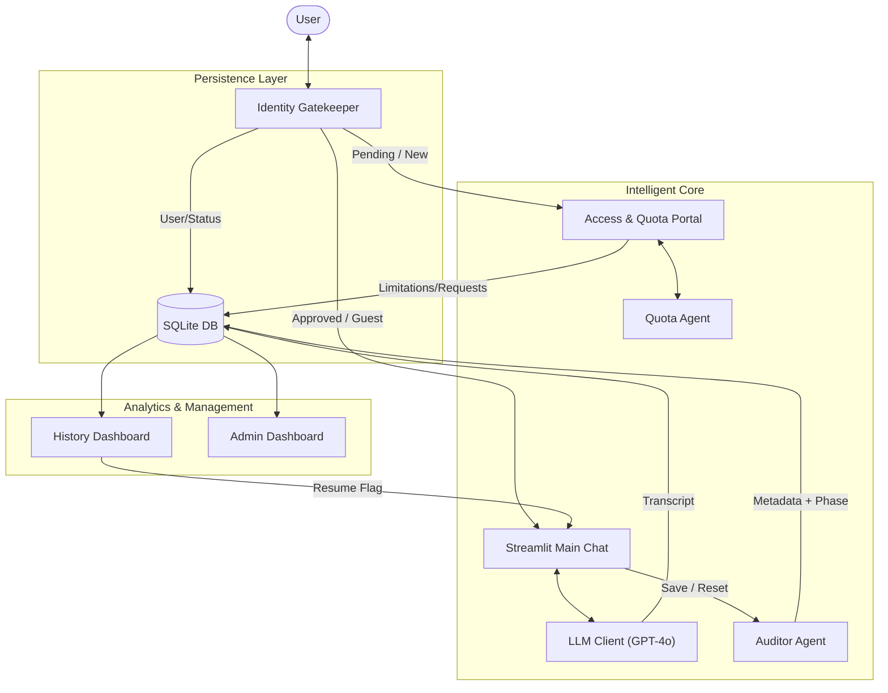
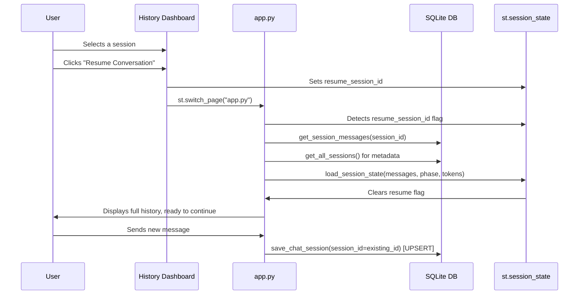
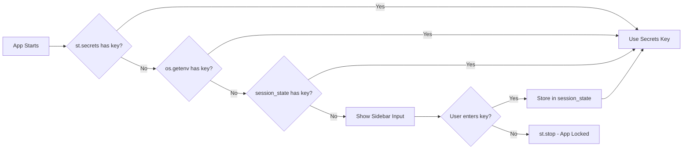

# System Architecture: Vantage Point AI

Vantage Point AI is a multi-agent diagnostic system built on **Streamlit**, **LangChain**, and **SQLite**. It is designed to bridge the gap between business requirements and technical solution blueprints, and to enable seamless session resumption across multiple engagements.

---

## 1. Multi-Agent Ecosystem

### A. The Consultant Agent (Orchestrator)
- **Role**: Primary user interface and diagnostic lead.
- **Responsibility**: Manages the multi-turn conversation (Greeting → Probing → Summary → Deep Dive).
- **Core Skill**: Zero-shot technical classification and dynamic question generation.

### B. The Auditor Agent (Governance)
- **Role**: Quality control, metadata extractor, and financial tracker.
- **Responsibilities**:
  - **Quality Scoring**: Evaluates conversations on a 1-10 scale.
  - **Cost Tracking**: Calculates token usage and USD costs (GPT-5.1 pricing).
  - **Intelligence Extraction**: Parses raw summaries into structured data (Category, Confidence, Rationale).
### C. The Quota Agent (Administration)
- **Role**: AI-driven administrative assistant.
- **Responsibilities**:
  - Reviews user extension requests and drafts business case justifications based on their previous chat analytics.

---

## 2. Data Flow Diagram

---

## 3. Session Resumption Flow

---

## 4. 3-Tier API Key Authentication

---

## 5. Database Schema

The system uses a local `data/conversations.db` SQLite database with three relational tables:

| Table | Key Columns | Purpose |
|---|---|---|
| `sessions` | `id`, `title`, `current_phase`, `audit_score`, `total_cost`, `is_active` | High-level session metadata |
| `messages` | `session_id`, `role`, `content` | Full conversational transcript |
| `assessments` | `session_id`, `classification`, `confidence_score`, `rationale` | Structured technical recommendations |

---

## 6. Financial Model (GPT-5.1)

To provide "Cloud Governance" visibility, the system implements a hypothetical GPT-5.1 pricing model:
- **Input Tokens**: $0.05 per 1k tokens.
- **Output Tokens**: $0.15 per 1k tokens.
- **Reporting**: Metrics are aggregated per session and globally in the History Dashboard via Plotly charts.
