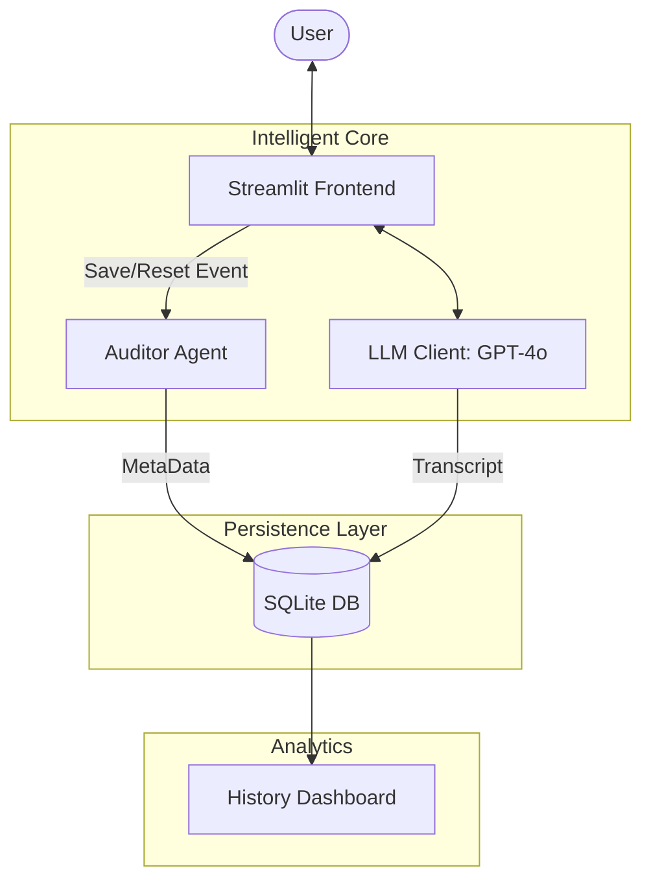

# System Architecture: Vantage Point AI

Vantage Point AI is a multi-agent diagnostic system built on **Streamlit**, **LangChain**, and **SQLite**. It is designed to bridge the gap between business requirements and technical solution blueprints.

## 1. Multi-Agent Ecosystem

The system utilizes an orchestrator-auditor pattern to ensure high-quality assessments and financial transparency.

### A. The Consultant Agent (Orchestrator)
- **Role**: Primary user interface and diagnostic lead.
- **Responsibility**: Manages the multi-turn conversation (Greeting -> Probing -> Summary -> Deep Dive).
- **Core Skill**: Zero-shot technical classification and dynamic question generation.

### B. The Auditor Agent (Governance)
- **Role**: Quality control and metadata extractor.
- **Responsibilities**:
  - **Quality Scoring**: Evaluates conversations on a 1-10 scale.
  - **Cost Tracking**: Calculates token usage and USD costs ($ GPT-5.1).
  - **Intelligence Extraction**: Parses raw summaries into structured data (Category, Confidence, Rationale).
  - **Auto-Labeling**: Generates AI titles for session persistence.

## 2. Data Flow Diagram

## 3. Database Schema

The system uses a local `data/conversations.db` with the following entities:

- **`sessions`**: Tracks session metadata (ID, Timestamp, Title, Total Cost, Audit Score, `is_active`).
- **`messages`**: Stores the full conversational transcript with roles (`user`, `assistant`).
- **`assessments`**: Stores the structured technical output (Classification, Confidence %, Technical Rationale).

## 4. Financial Model (GPT-5.1)

To provide "Cloud Governance" visibility, the system implements a hypothetical GPT-5.1 pricing model:
- **Input Tokens**: $0.05 per 1k tokens.
- **Output Tokens**: $0.15 per 1k tokens.
- **Reporting**: Metrics are aggregated per session and globally in the History Dashboard.
